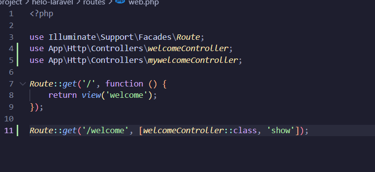
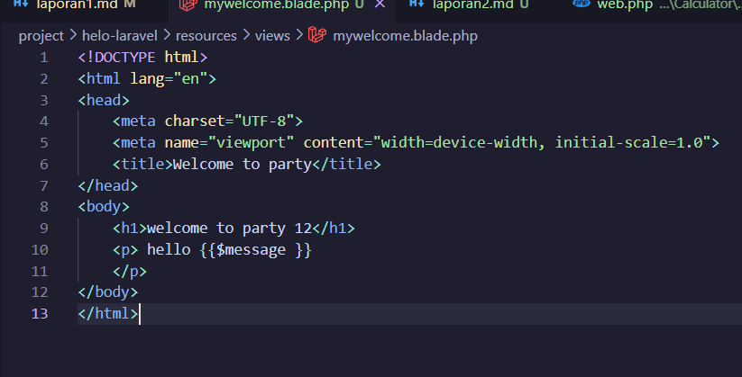
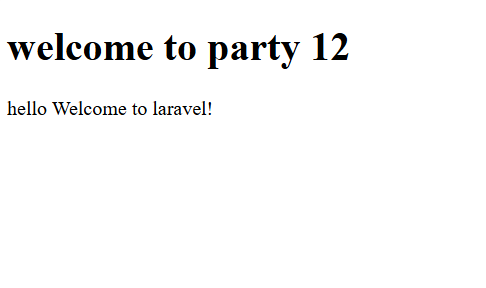
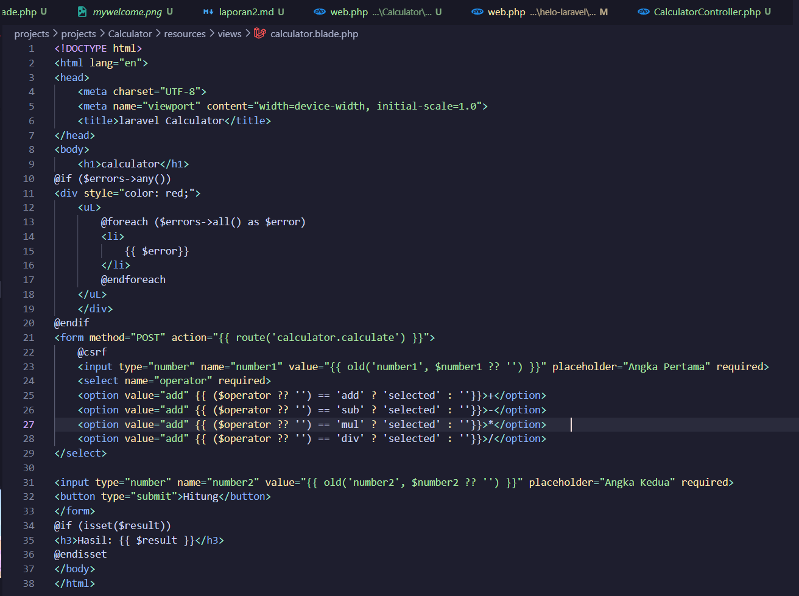
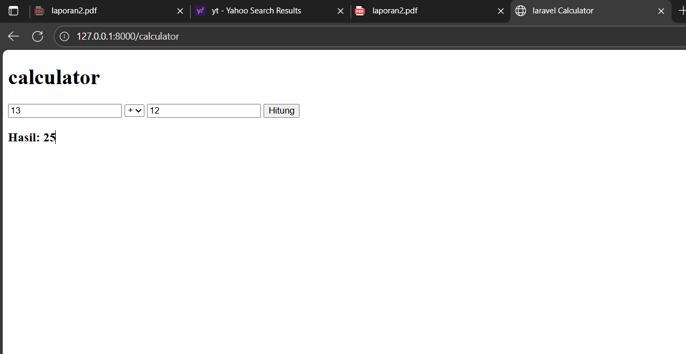

# Laporan Modul 2: Laravel Fundamentasl
**Mata Kuliah:** Workshop Web Lanjut   
**Nama:** Alvi Syahril 
**NIM:** 2024573010090
**Kelas:** TI-2C

---

## Abstrak 

Modul ini akan memperkenalkan kita pada fondasi fundamental dalam membangun aplikasi Laravel yang efisien dan efektif. dengan fokus pada implementasi pola arsitektur Model-View-Controller (MVC), mekanisme Routing, serta penggunaan Blade Templating Engine. Praktikum dilakukan untuk memahami bagaimana Laravel menangani alur request–response, bagaimana controller berperan sebagai penghubung logika bisnis dan tampilan, serta bagaimana Blade mempermudah pengelolaan antarmuka. Tujuan laporan ini adalah memberikan gambaran menyeluruh tentang dasar teori dan langkah-langkah praktis dalam membangun aplikasi web sederhana menggunakan Laravel, sehingga dapat menjadi fondasi untuk pengembangan aplikasi web yang lebih kompleks.

--- 

## 1. Dasar Teori
- Apa itu MVC (Model, View, Controller).
 MLaravel mengadopsi pola arsitektur MVC yang membagi aplikasi menjadi tiga bagian utama. Model adalah bagian yang mengatur data dan berinteraksi dengan basis data. View merupakan bagian yang menyajikan data dalam bentuk tampilan antarmuka kepada pengguna. Controller berperan sebagai penghubung yang menerima request dari pengguna, memproses logika bisnis dengan bantuan model, dan kemudian mengirimkan data yang sesuai ke view untuk ditampilkan. Pemisahan ini menjadikan aplikasi lebih modular, mudah dikelola, serta mempermudah proses pengembangan ketika dilakukan oleh tim.

- Konsep Routing di Laravel.
Routing dalam Laravel memiliki peranan penting sebagai jembatan awal antara permintaan pengguna dan respon yang diberikan aplikasi. Setiap kali pengguna mengakses URL tertentu, request tersebut akan diarahkan oleh sistem routing menuju fungsi, closure, atau controller yang sesuai. Misalnya, jika sebuah route didefinisikan untuk URL “/hello”, maka setiap akses ke alamat tersebut akan menampilkan respon yang telah didefinisikan sebelumnya..

- Fungsi Middleware.
Middleware adalah lapisan perantara yang dilalui oleh request sebelum mencapai controller. Fungsinya mirip seperti filter, yakni memastikan bahwa request yang masuk memenuhi syarat tertentu. Contoh paling sederhana adalah middleware autentikasi yang hanya mengizinkan pengguna login untuk mengakses halaman tertentu.

- Laravel menangani request dan response melalui proses yang berlapis. Setiap request yang dikirim pengguna pertama kali masuk ke file public/index.php. Dari sana, request diproses oleh kernel Laravel, kemudian melewati middleware yang relevan. Setelah itu, request diteruskan ke sistem routing, yang menentukan controller atau fungsi mana yang akan dijalankan. Controller kemudian mengolah data, berinteraksi dengan model jika diperlukan, dan akhirnya menghasilkan sebuah response, biasanya berupa view atau data dalam format JSON.

- Peran Controller dan View.
Controller memiliki peran sentral sebagai pengatur logika aplikasi. Ia bertugas menerima request, memproses data dengan bantuan model, dan menentukan view yang akan digunakan untuk menampilkan hasilnya. View, di sisi lain, bertugas menyajikan data kepada pengguna dalam bentuk halaman HTML atau antarmuka lainnya. Laravel mempermudah pembuatan view dengan menghadirkan Blade Templating Engine, sebuah sistem templating yang sederhana namun sangat kuat. Blade memungkinkan developer menulis kode HTML yang dinamis dengan sintaks yang singkat dan mudah dipaham

- Fungsi Blade Templating Engine.
---

## 2. Langkah-Langkah Praktikum
Tuliskan langkah-langkah yang sudah dilakukan, sertakan potongan kode dan screenshot hasil.
2.1 Praktikum 1 – Route, Controller, dan Blade View

- Tambahkan route pada routes/web.php.
buka folder routes/web.php
kemudian isi dengan kode berikut:

route ini akan memberitahu laravel untuk memanggil method show() yang ada di dalam file WelcomeController ketika user mengunjungi /welcome.

- Buat controller WelcomeController.
Buka terminal(git bash) dan jalankan perintah berikut untuk membuat controller.
php artisan make:controller WelcomeController
kemudian isi dengan kode berikut

- Buat view mywelcome.blade.php.
buat file bernama mywelcome.blade.php di dalam folder resources/views
selanjutnya isi dengan kode berikut

- Jalankan aplikasi dan tunjukkan hasil di browser.
ketik php artisan serve di git bash atau terminal

Screenshot Hasil:

2.2 Praktikum 2 – Membuat Aplikasi Sederhana "Calculator"

- Tambahkan route untuk kalkulator.
buka folder routes/web.php
kemudian isi dengan kode berikut:   
Route::get('/calculator', [CalculatorController::class, 'index']);
Route::post('/calculator', [CalculatorController::class, 'calculate'])->name('calculator.calculate');

- Buat controller CalculatorController.
buka terminal atau gitbash kemudian ketik kode berikut 
php artisan make:controller WelcomeController

- Tambahkan view calculator.blade.php.
buat file bernama calculator.blade.php di dalam folder resources/views
selanjutnya isi dengan kode berikut

- Jalankan aplikasi dan coba dengan beberapa input berbeda.
buka terminal atau gitbash kemudian ketik kode berikut 
php artisan make:controller WelcomeController;

Screenshot Hasil:

---

## 3. Hasil dan Pembahasan
Jelaskan apa hasil dari praktikum yang dilakukan.
- Apakah aplikasi berjalan sesuai harapan?  
Ya, aplikasi berjalan sesuai harapan. Route mengarahkan request ke controller dan view tampil dengan Blade.

- Apa yang terjadi jika ada input yang salah (misal pembagian dengan 0)?  
Jika membagi dengan 0, muncul pesan error karena validasi di controller.

- Bagaimana validasi input bekerja di Laravel?  
Validasi input memakai $request->validate(), otomatis memberi feedback jika input salah.

- Apa peran Route, Controller, View?  
Route: mengarahkan request.  
Controller: memproses logika dan memilih view.  
View: menampilkan hasil ke pengguna.

---

## 4. Kesimpulan

Tulis kesimpulan dari praktikum ini
Melalui praktikum ini, dapat disimpulkan bahwa Laravel menyediakan alur kerja yang terstruktur melalui penerapan pola MVC. Routing berfungsi sebagai pintu masuk yang menentukan kemana sebuah request harus diarahkan. Middleware berperan penting sebagai filter untuk menjaga keamanan dan integritas request. Controller menjadi penghubung utama antara logika bisnis dan tampilan, sementara View melalui Blade Templating Engine menyediakan mekanisme pembuatan antarmuka yang dinamis dengan sintaks yang sederhana. Praktikum sederhana berupa pembuatan halaman sambutan dengan route, controller, dan view menunjukkan bahwa meskipun dasar, alur kerja Laravel sudah cukup terorganisir dan memberikan fondasi yang kuat untuk membangun aplikasi web berskala besar..
---

## 5. Referensi
Cantumkan sumber yang Anda baca (buku, artikel, dokumentasi) — minimal 2 sumber. Gunakan format sederhana (judul — URL).

https://hackmd.io/@mohdrzu/B1zwKEK5xe
https://laravel.com/docs
LARAVELhttps://laracasts.com
---
